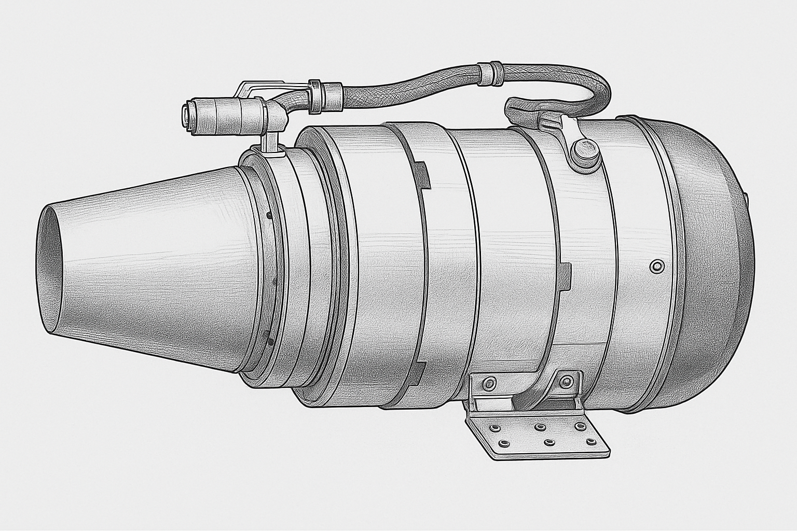

# Redmoon 40KGF Open Source Turbojet Engine 🚀🔥  

  
*Isometric sketch of current open-source configuration*  

---

## Overview  

The **40KG Forced Turbojet Engine** is a cutting-edge micro gas turbine producing **40 kilograms of thrust** in a compact form factor. Built on the principles of the Brayton cycle, it compresses, ignites, and expels air at extreme velocities to generate thrust.  

This project is the **first open-source initiative** making such a powerful engine accessible to developers, aerospace researchers, drone builders, and hobbyists worldwide.  

> **Why is this a big deal?**  
> - Lightweight but capable of lifting heavy platforms.  
> - Designed with modular, analyzable components.  
> - Includes safety documentation and ECU integration.  
> - Opens the door for innovation in UAVs, propulsion research, and experimental aerospace.  

---

## Key Features ✨  

- **40KG of Continuous Thrust** — enough to lift large drones and experimental craft.  
- **Compact & Robust Design** — billet-machined compressor wheel, high-temp alloys, precision bearings.  
- **Advanced Engine Control Unit (ECU)** — with auto-start, telemetry, thrust curve programming, and flameout recovery.  
- **Complete Documentation** — manuals, safety protocols, and whitepapers included.  
- **Open Source** — enabling contributions from engineers, students, and enthusiasts worldwide.  

---

## How It Works ⚙️  

Like all turbojets, the 40KG engine follows the four-stage cycle:  

1. **Intake (Suck)** — Air is drawn in through the *Inlet Runner*.  
2. **Compression (Squeeze)** — The *Billet Wheel* and *Diffuser* compress the air.  
3. **Combustion (Bang)** — Injectors atomize fuel in the *Combustion Chamber*, ignited by a *Glow Plug*.  
4. **Exhaust (Blow)** — Superheated gases drive the *Turbine Wheel* and are expelled at high velocity through the *Exhaust Nozzle*.  

| Front | Side | Rotor & Hot Section |
|-------|------|--------------------|
|  |  |  |
*Representative multi-view & rotor composite sketches (see `DOCS/SKETCHES/SKETCHES.md` for full catalog)*

---

## Components 🧩  

Here’s the condensed **parts list** from the full documentation:  

### Core Mechanical & Structural  

| Component                | Function                                                                 |
|--------------------------|---------------------------------------------------------------------------|
| Inlet Runner             | Captures ambient air and guides it into the compressor.                   |
| Billet Wheel             | Centrifugal compressor impeller, machined for strength & precision.       |
| Diffuser                 | Converts kinetic energy into high static pressure.                        |
| Combustion Chamber (In/Out) | Mixes air and fuel, sustains controlled combustion.                   |
| NGV + Evaporator         | Directs hot gas to turbine & vaporizes fuel for efficient combustion.     |
| Turbine Wheel & Shaft    | Extracts energy from hot gases, drives the compressor.                    |
| Turbine Shaft Sleeve     | Provides structural support & smooth operation of the shaft.              |
| Cartridge Receiver       | Holds rotating group in alignment.                                        |
| Cowling & Transit Ring   | Protects internals and ensures aerodynamic airflow.                       |
| Bearing Pad, Oil Ring, Oil Pipe, Clamps, Fasteners | Provide stability, lubrication, and assembly integrity. |

### Auxiliary Systems  

| Component           | Function                                                                 |
|---------------------|---------------------------------------------------------------------------|
| ECU (Engine Control Unit) | Automated startup, monitoring, thrust control, telemetry.           |
| GSU (Ground Support Unit) | Color LCD, field interface for monitoring/configuration.            |
| Starter Motor & Connector | Spins shaft during startup until combustion self-sustains.          |
| Glow Plug           | Ignites fuel-air mixture at startup.                                      |
| Fuel Pump & Injectors | Delivers and atomizes fuel into combustion chamber.                     |
| Sensors (RPM, EGT)  | Provide real-time safety/operational data.                                |
| Fuel Shut-off Valve | Emergency cutoff of fuel flow.                                            |
| Fuel Lines          | Deliver fuel from tank to combustion system.                             |
| LiPo Battery        | Powers ECU and receiver.                                                  |
| Radio Receiver      | Receives throttle commands for remote control.                            |

> See the full component catalog with functional explanations in [`Redmoon-40KGF-OPEN-SOURCE-MODEL/PARTS/PARTS.md`](./Redmoon-40KGF-OPEN-SOURCE-MODEL/PARTS/PARTS.md) and detailed sketches in [`DOCS/SKETCHES/SKETCHES.md`](./DOCS/SKETCHES/SKETCHES.md).

---

## Capabilities 🚁  

The 40KG Turbojet enables advanced applications such as:  

- **Heavy-Lift UAVs** — cargo drones, rescue drones, and next-gen delivery systems.  
- **Experimental Aviation** — small jet prototypes, supersonic research.  
- **STEM & Research** — a fully documented, open-source jet engine for aerospace labs and universities.  

---

## Safety & Responsibility ⚠️  

Operating turbines carries **significant risks**, including high temperatures (up to ~1000°C), high-speed rotating parts, toxic oil fumes, and acoustic hazards.  

Always follow:  
- Pre-operational safety checklists.  
- Use of fire extinguishers & protective equipment.  
- Strict distance rules for bystanders (≥20m).  
- Qualified ground assistants during startup.  

*This is not a beginner’s engine. Use responsibly. Read `ETHICS.md`, `CODE_OF_CONDUCT.md`, and the safety protocol in `DOCS/REFERENCE/` before any physical test.*  

---

## Why Open Source? 🌍  

We believe in **democratizing aerospace technology**. By opening this project:  

- Researchers can **study and improve** small-scale turbine design.  
- Makers and students can **experiment without reinventing the wheel**.  
- The community can **contribute innovations**, from new fuel systems to smarter ECU firmware.  
- Transparency ensures **safety, reproducibility, and rapid iteration**.  

---

## How to Contribute 🤝  

- Fork this repo and contribute improvements (designs, firmware, safety add-ons).  
- Share experimental results, modifications, or new use-cases.  
- Help us document — add tutorials, CAD diagrams, 3D-printed mounts, or flight data.  

Contributions help make this the **world’s most transparent, responsibly engineered open-source micro‑turbine project.**  

Quick links:
- Governance & Behavior: [`CODE_OF_CONDUCT.md`](./CODE_OF_CONDUCT.md) · [`COMMUNITY.md`](./COMMUNITY.md)
- Ethics & Responsible Use: [`ETHICS.md`](./ETHICS.md)
- Contribution Process: [`CONTRIBUTING.md`](./CONTRIBUTING.md)
- Parts & Sketches: [`PARTS.md`](./Redmoon-40KGF-OPEN-SOURCE-MODEL/PARTS/PARTS.md) · [`SKETCHES.md`](./DOCS/SKETCHES/SKETCHES.md)
- Reference Papers: [`DOCS/REFERENCE/`](./DOCS/REFERENCE/)
- Contact: [`CONTACTS.md`](./CONTACTS.md)

---

## License 📜  

This project is licensed under the **Apache License 2.0**.  

You may obtain a copy of the License at:  
[http://www.apache.org/licenses/LICENSE-2.0](http://www.apache.org/licenses/LICENSE-2.0)  

Unless required by applicable law or agreed to in writing, software and hardware distributed under the License is distributed on an **"AS IS" BASIS**, WITHOUT WARRANTIES OR CONDITIONS OF ANY KIND.

---
### Attribution & Ethical Reminder
Use only for peaceful, educational, and research purposes. Prohibited: weaponization, unlawful surveillance, harmful deployment. Report suspected misuse via the contacts listed in `CONTACTS.md`.

---