# Redmoon 40KGF Turbojet Engine – Parts & Component Reference

This document catalogs all major components of the Redmoon 40KGF open-source turbojet engine, with sketches, images, and concise functional explanations. For theory, safety, and detailed analysis, see the reference PDFs in `DOCS/REFERENCE/`.

---
## Table of Contents
1. [Inlet & Flow Conditioning](#inlet--flow-conditioning)
2. [Combustion System](#combustion-system)
3. [Fuel Evaporation & Mixing](#fuel-evaporation--mixing)
4. [Turbine & Hot Section](#turbine--hot-section)
5. [Bearing & Lubrication](#bearing--lubrication)
6. [Structural & Retention Hardware](#structural--retention-hardware)
7. [Cowling & External Ducting](#cowling--external-ducting)
8. [Starter & Ancillary Interfaces](#starter--ancillary-interfaces)
9. [Transit / Alignment Rings](#transit--alignment-rings)
10. [3D Views & Composite Sketches](#3d-views--composite-sketches)

---
## 1. Inlet & Flow Conditioning
Efficient airflow into the compressor is critical for engine performance.

- **Inlet Runner**
  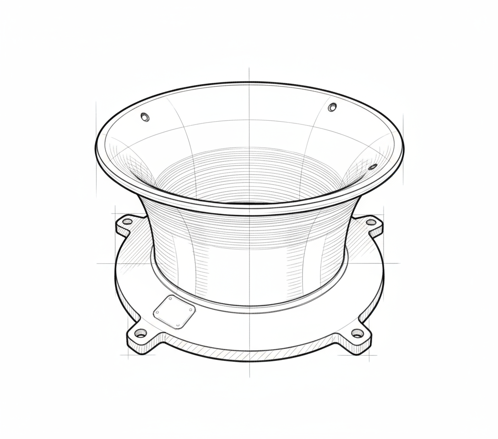
  Guides ambient air to the compressor inducer, minimizing turbulence.
- **Inlet Runner Airflow**
  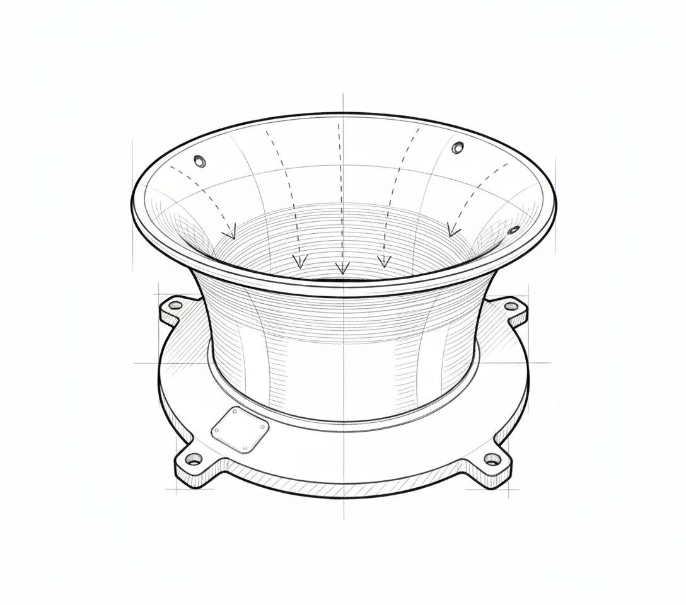
  Shows boundary layer and flow pathlines.
- **Inlet Runner Top-Down**
  
  Illustrates symmetry and alignment datum.

## 2. Combustion System
Staged air admission and recirculation for stable flame anchoring.

- **Combustion Chamber**
  
  Main shell with primary/secondary/dilution air holes.
- **Combustion Chamber Outlet**
  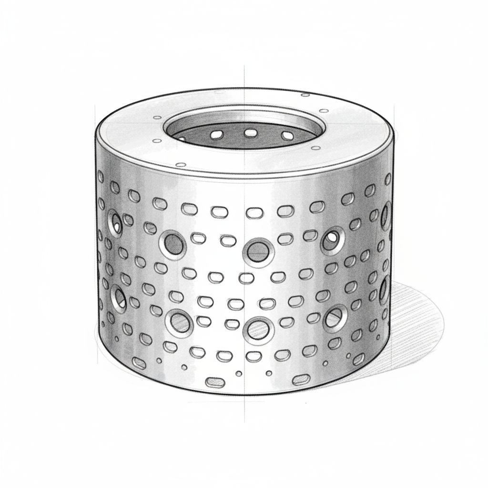
  Focuses on dilution and temperature conditioning.

## 3. Fuel Evaporation & Mixing
Pre-vaporizing fuel improves atomization and reduces hotspots.

- **Evaporator**
  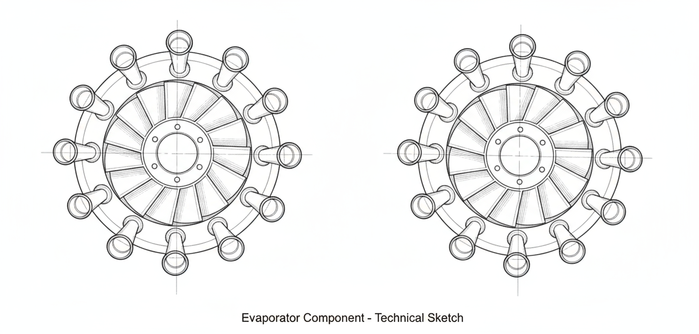
  Pre-vaporizes fuel before entering the flame zone.
- **NGV & Evaporator Relation**
  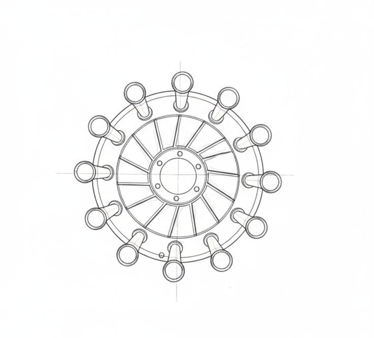
  Shows spatial clearance between fuel path and NGV.

## 4. Turbine & Hot Section
Extracts energy from combustion gases and controls temperature profile.

- **Nozzle Guide Vane (NGV)**
  
  Directs flow and manages metal temperature.
- **Turbine Shaft Sleeve**
  
  Couples turbine wheel and isolates heat.
- **Rotor Composite**
  
  Shows energy extraction and rotor dynamics base.

## 5. Bearing & Lubrication
Maintains low-friction, thermally managed rotor support.

- **Oil Ring**
  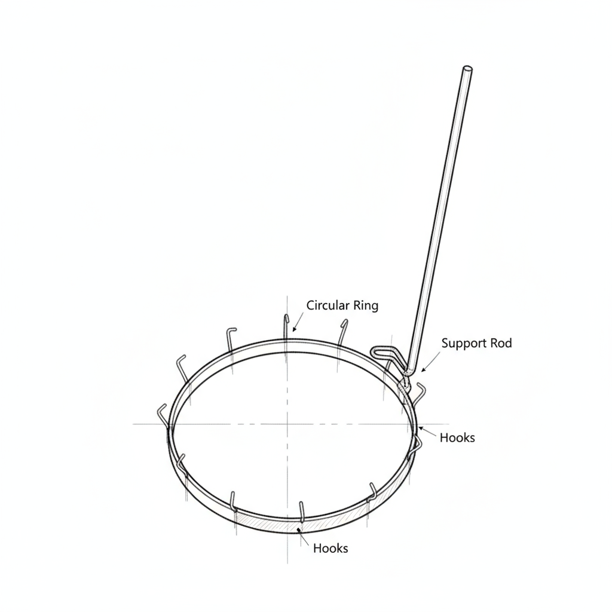
  Distributes lubricant and reduces coking.
- **Bearing Pad**
  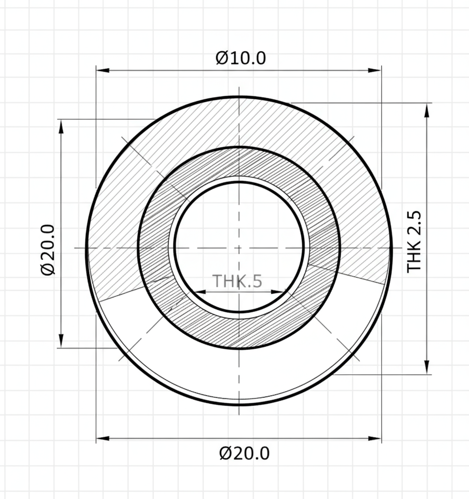
  Distributes bearing and thrust loads.

## 6. Structural & Retention Hardware
Provides alignment and support for stacked modules.

- **Cartridge Receiver**
  
  Locates turbo core and fastener indexing.

## 7. Cowling & External Ducting
Manages intake, enclosure safety, and airflow visualization.

- **Cowling Shell**
  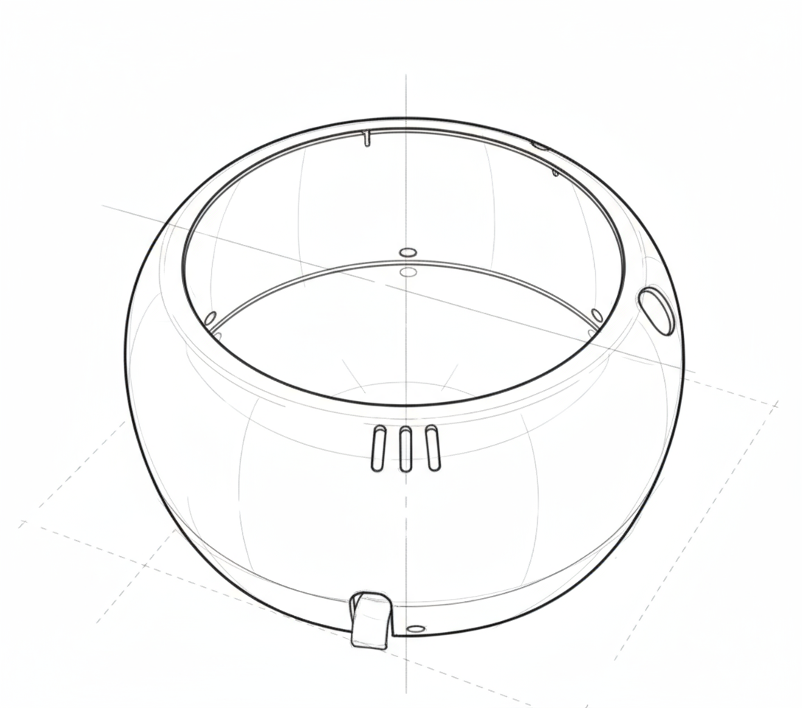
  Shapes external enclosure and intake.
- **Cowling Airflow**
  
  Highlights pressure recovery zones.

## 8. Starter & Ancillary Interfaces
Enables initial rotor spin-up and instrumentation.

- **Starter Connector**
  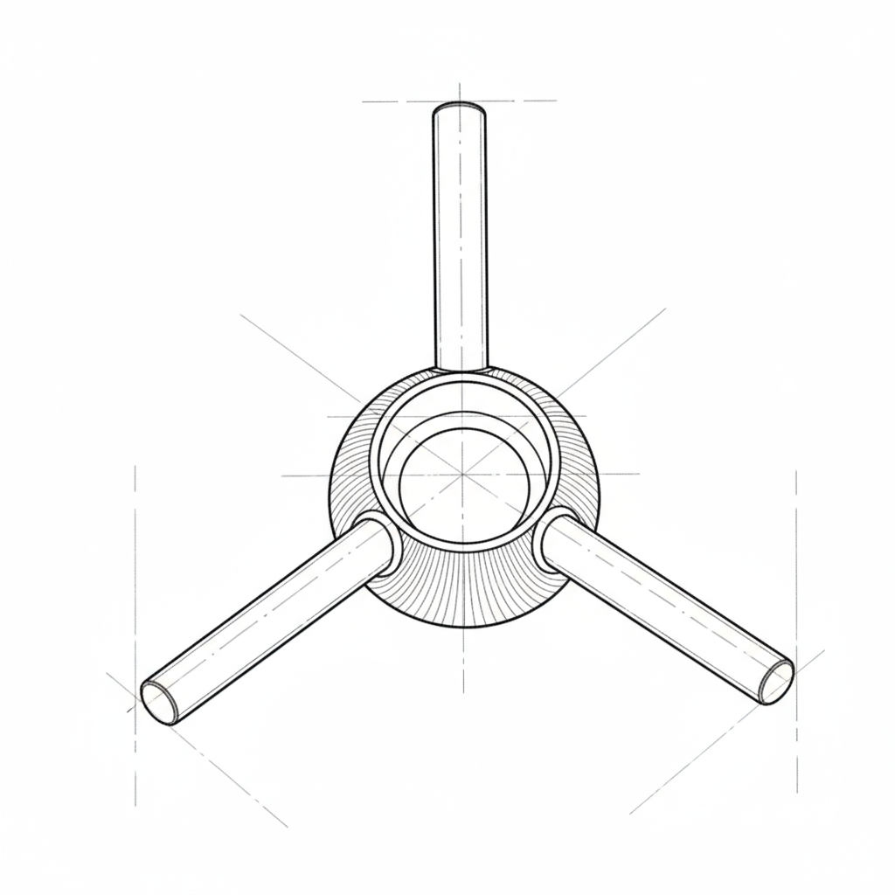
  Transmits torque during spool-up.

## 9. Transit / Alignment Rings
Maintain axial stack and assist in handling.

- **Transit Ring (Initial)**
  
  Provides spacing and protection.
- **Transit Ring (Refined)**
  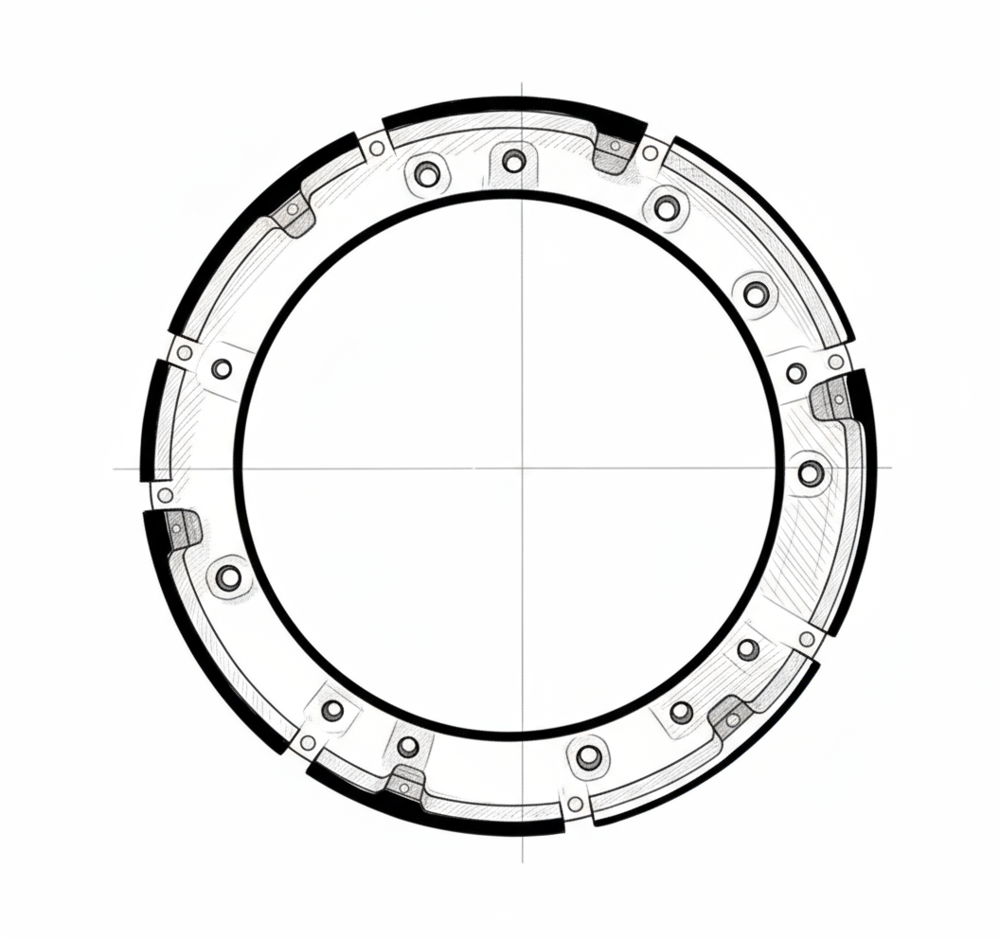
  Optimizes weight and alignment.
- **Transit Ring Engineering**
  
  Shows finalized hole pattern and tolerances.

## 10. 3D Views & Composite Sketches
Visualize overall engine geometry and assembly relations.

- **3D Front View**
  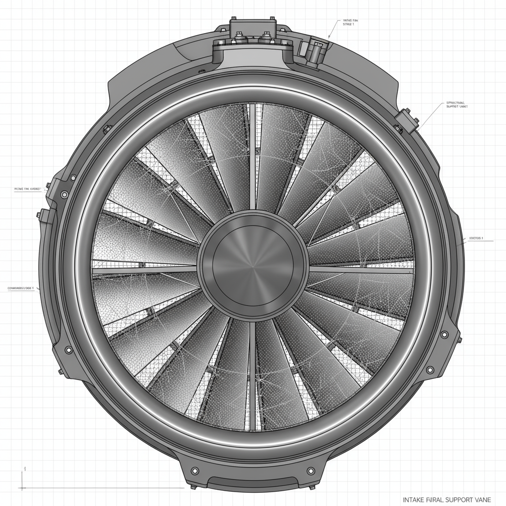
- **3D Isometric View**
  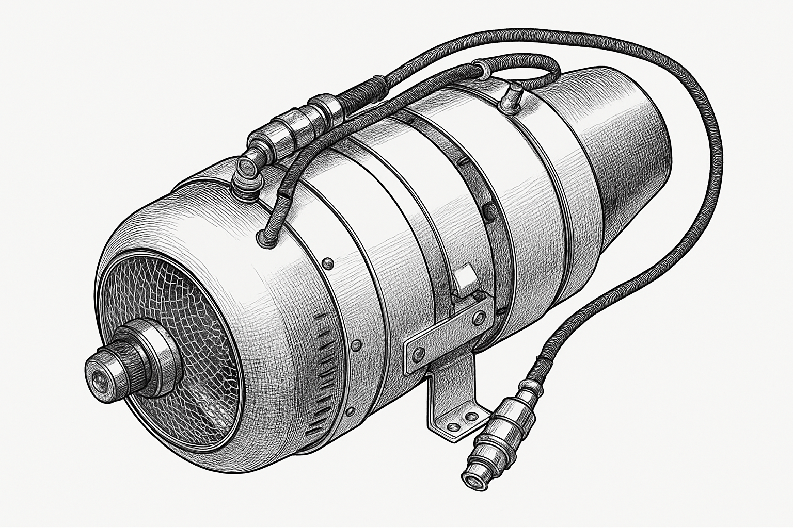
- **3D Side View**
  
- **Additional Sketches**
  
  
  

---
## Further Reading & Reference
- [How a 40KG Turbojet Engine Creates Thrust](../../DOCS/REFERENCE/How%20a%2040KG%20Turbojet%20Engine%20Creates%20Thrust.pdf)
- [An Easy-to-Understand Breakdown of the 40KG Turbojet's Main Components](../../DOCS/REFERENCE/An%20Easy-to-Understand%20Breakdown%20of%20the%2040KG%20Turbojet's%20Main%20Components.pdf)
- [Technical Whitepaper - 40KG Turbojet Engine Control Unit (ECU)](../../DOCS/REFERENCE/Technical%20Whitepaper%20-%2040KG%20Turbojet%20Engine%20Control%20Unit%20(ECU).pdf)
- [Official Safety & Emergency Protocol](../../DOCS/REFERENCE/40KG%20Turbojet%20Engine%20-%20Official%20Safety%20&%20Emergency%20Protocol.pdf)
- [Anatomy of the 40KGF Turbojet Engine – Functional Analysis](../../DOCS/REFERENCE/Anatomy%20of%20the%2040KGF%20Turbojet%20Engine%20-%20A%20Component_by_Component%20Functional%20Analysis.pdf)

---
## Revision & Attribution
- Revision: Generated 2025-09-13
- Attribution: Redmoon 40KGF Open Source Project
- For updates, add new sketches and update the table of contents.
